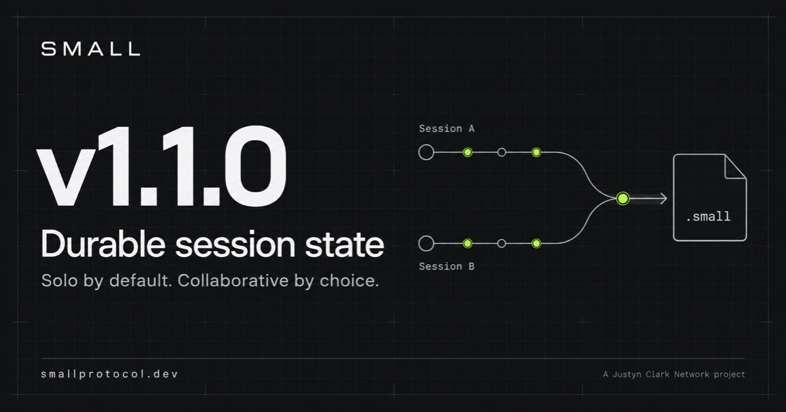
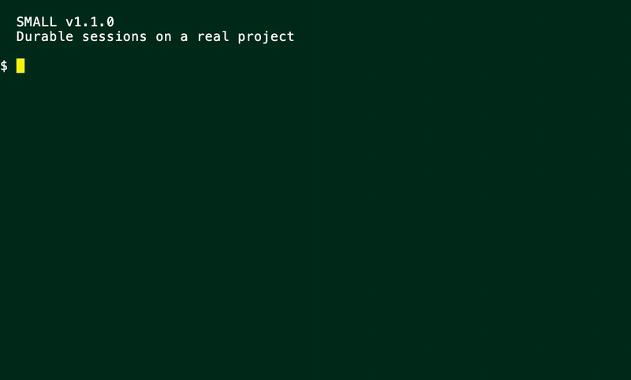

# SMALL Protocol

[](https://github.com/justyn-clark/small-protocol/actions/workflows/ci.yml)
[](https://github.com/justyn-clark/small-protocol/actions/workflows/release.yml)
[](https://github.com/justyn-clark/small-protocol/releases)
[](https://www.npmjs.com/package/@small-protocol/small)
[](https://go.dev)
[](LICENSE)

**SMALL (Schema, Manifest, Artifact, Lineage, Lifecycle)** is a formal state protocol that makes AI-assisted work legible, auditable, and resumable by separating durable state from ephemeral execution.

It defines versioned machine-readable artifacts that replace ephemeral chat history with durable project state.

## SMALL v1.1.0: Durable Session State

Solo by default. Collaborative by choice. SMALL preserves the state around AI-assisted work so another run, machine, or operator can inspect and resume it.

<p align="center">
  <a href="https://github.com/justyn-clark/small-protocol/releases/tag/v1.1.0">
    
  </a>
</p>

### See it work on a real project

This 31-second demonstration uses the released `small v1.1.0` binary against an existing SMALL-enabled repository. The commands and state transitions are real, not simulated output.

<p align="center">
  <a href="docs/media/small-v1-1-0-session-demo.mp4">
    
  </a>
</p>

**Watch full quality:** [MP4](docs/media/small-v1-1-0-session-demo.mp4) · [WebM](docs/media/small-v1-1-0-session-demo.webm) · [v1.1.0 release notes](https://github.com/justyn-clark/small-protocol/releases/tag/v1.1.0)

<details>
<summary>What the demonstration verifies</summary>

- strict validation of existing canonical SMALL state;
- explicit migration to the v2.0.0 session profile;
- solo mode as the default;
- session creation and an explicit transition to collaborative mode; and
- a final strict validation pass.

</details>

## What SMALL Is Not

- An agent framework
- A prompt format
- A workflow engine
- A multi-agent system

SMALL is a **governance and continuity layer**.

## The v1 Canonical Artifacts

| Artifact                | Owner  | Purpose                       |
|-------------------------|--------|-------------------------------|
| `intent.small.yml`      | Human  | Declares what the work is     |
| `constraints.small.yml` | Human  | Declares what must not change |
| `plan.small.yml`        | Agent  | Proposed execution steps      |
| `progress.small.yml`    | Agent  | Verified execution evidence   |
| `handoff.small.yml`     | System | Serialized resume checkpoint  |

Every v1 artifact declares `small_version: "1.0.0"` and validates against the
v1 schemas. V2 uses a separate JSON session/event layout and its own schemas;
it does not add fields to these v1 YAML files.

## Version

This repository implements **SMALL Protocol v1.0.0 and the separately versioned v2.0.0 session profile**.

- v1.0.0 is stable
- v1 workspaces remain single-writer and are never automatically migrated
- v2 defaults to solo sessions and enables collaboration only through an explicit mode transition
- Both versions have separate authoritative schemas and invariants

## Specification

The authoritative specification is located at:

```
spec/small/v1.0.0/
|- SPEC.md
|- schemas/
`- examples/
```

The session-capable contract is in `spec/small/v2.0.0/`. See
[SMALL 2.0.0 session profile](docs/session-profile-v2.md) for migration and use.

Want to inspect finished state instead of reading the specification first?
Open the **[examples gallery](examples/)** for a real v2 durable session, the
31-second terminal demonstration, and focused v1 protocol labs.

## Getting Started

**New to SMALL?** Start here:

1. [Getting Started Guide](docs/getting-started.md) - Answers "Do I manually type these files?" and walks through the workflow
2. [Agent Operating Contract](docs/agent-operating-contract.md) - Required reading for AI agents using SMALL

**Human workflow**: Edit `intent.small.yml` and `constraints.small.yml`. The agent handles the rest.

**Agent workflow**: Read `.small/` first, respect ownership rules, validate before claiming success, handoff when stopping.

## Documentation

| Document | Description |
|----------|-------------|
| [Getting Started](docs/getting-started.md) | First-time user guide with examples |
| [Agent Operating Contract](docs/agent-operating-contract.md) | Behavioral rules for AI agents |
| [CLI Guide](docs/cli-guide.md) | Detailed command reference with error handling |
| [Installation](docs/installation.md) | Install via npm global package or curl installer |
| [Quick Start](docs/quickstart.md) | Initialize and validate a SMALL workspace |
| [CLI Reference](docs/cli.md) | Command summary table |
| [Invariants](docs/invariants.md) | Non-negotiable protocol rules |
| [Enterprise Integration](docs/enterprise.md) | Git, CI/CD, and audit patterns |
| [Philosophy](docs/philosophy.md) | Design rationale and non-goals |
| [FAQ](docs/FAQ.md) | Frequently asked questions |
| [Execution Model](docs/EXECUTION_MODEL.md) | Single-writer design and concurrency |
| [Session Profile v2](docs/session-profile-v2.md) | Solo/collaborative sessions, reconciliation, evidence, and migration |
| [Examples Gallery](examples/) | Runnable v1 labs and a complete v2 durable-session workspace |
| [Development](docs/DEVELOPMENT.md) | Building, testing, and schema updates during development |
| [Releasing](docs/maintainers/releasing.md) | Maintainer release process and npm publish policy |
| [Docs Sync](docs/maintainers/docs-sync.md) | Canonical docs sync model, mapping, and verification gates |

## Quick Start

Run all commands from your repository root.

```bash
# Install
npm i -g @small-protocol/small
small version

# Verify the install works end-to-end
small selftest

# Initialize
small init --intent "My project description"

# Diagnose workspace health (read-only)
small doctor
small health

# Reconstruct task evidence from durable SMALL state
small reconstruct --task task-1

# Validate
small validate
```

Install alternatives (including curl installer) are documented in [Installation](docs/installation.md).

The CLI supports unmigrated `v1.0.0` workspaces and explicit `v2.0.0` session-profile workspaces.
See the [v1.0.0 release notes](https://github.com/justyn-clark/small-protocol/releases/tag/v1.0.0) for the original launch details.

Pre-built binaries are available on the [GitHub Releases](https://github.com/justyn-clark/small-protocol/releases) page.
See [Installation](docs/installation.md) for checksum verification and PATH setup.

## License

Apache License 2.0. See [LICENSE](LICENSE).
