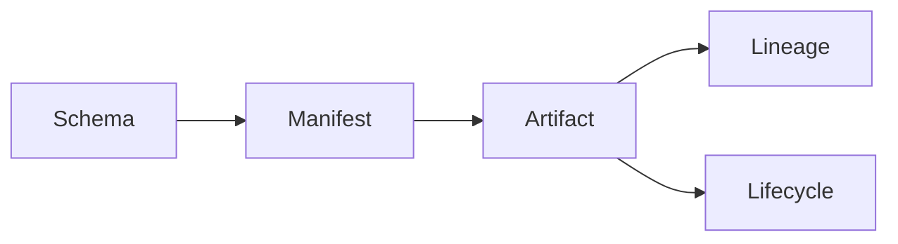
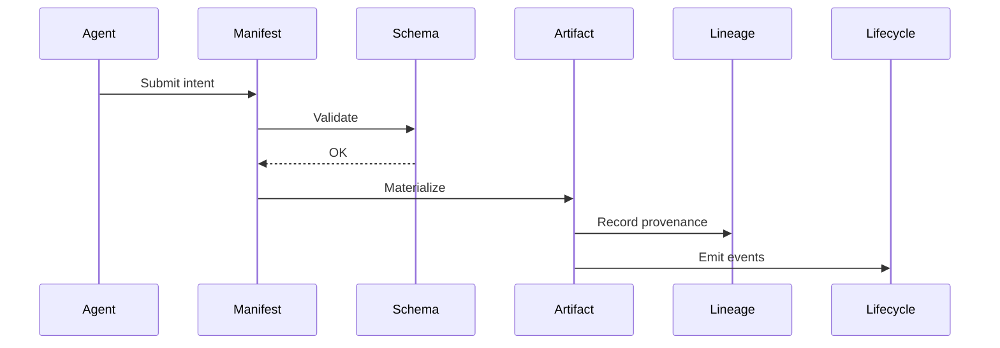
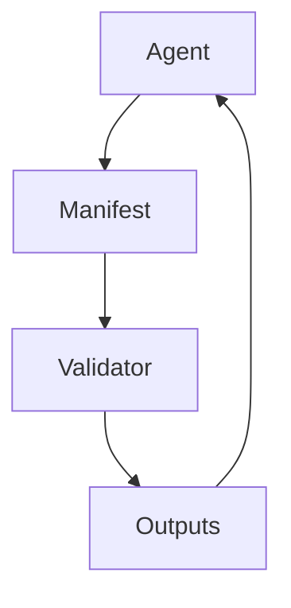

# SMALL Model

Visual representations of the SMALL execution model.

---

## Ontology

The SMALL primitives and their relationships.

Schemas define contracts; manifests bind them to artifacts; artifacts produce lineage and lifecycle events.

---

## Execution

The sequence of operations when an agent interacts with SMALL.

Agents submit intent through manifests; validation occurs against schemas; artifacts materialize and generate lineage and lifecycle records.

---

## Safety Boundary

The validation boundary that ensures agent outputs conform to contracts.

All agent outputs pass through a validator that enforces schema contracts before materialization.
