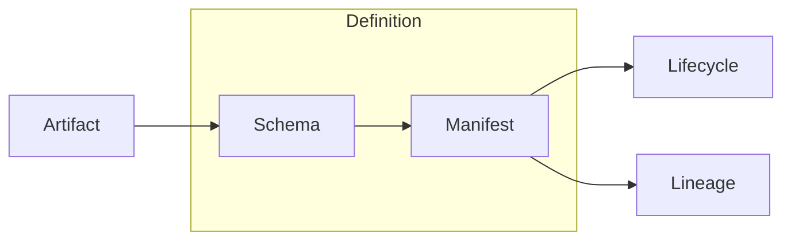

Defines **Artifact**, **Schema**, **Manifest**, **Lifecycle**, **Lineage**, and **Agent Action** for the Agent-Legible CMS.

This spec is intentionally *boring on purpose*: deterministic primitives scale. Chaos doesn't.

---

## Artifact

An **Artifact** is the smallest addressable, versioned unit in the system.  
Artifacts are immutable once published (new versions are new artifacts).

```ts
type Artifact = {
  id: string
  version: number
  kind?: string
}

const artifact: Artifact = {
  id: "a1",
  version: 1,
  kind: "spec.example",
}
```

```json
{
  "type": "Artifact",
  "id": "a1",
  "version": 1,
  "kind": "spec.example"
}
```

```yaml
artifact:
  id: a1
  version: 1
  kind: spec.example
```


## Schema

A Schema defines structure and validation rules for artifacts.
Schemas are versioned, referenced by ID, and treated as first-class artifacts.

```json
{
  "$id": "schema:artifact:v1",
  "$schema": "https://json-schema.org/draft/2020-12/schema",
  "title": "Artifact",
  "type": "object",
  "required": ["id", "version"],
  "properties": {
    "id": { "type": "string" },
    "version": { "type": "integer", "minimum": 1 },
    "kind": { "type": "string" }
  },
  "additionalProperties": false
}
```


## Manifest

A Manifest binds artifacts + schemas + policies into a deployable unit.
Manifests are what agents consume to understand "what exists" and "how to validate it".

```yaml
manifest:
  id: manifest:primitives-v1
  version: 1
  artifacts:
    - a1
  schemas:
    - schema:artifact:v1
  policies:
    deterministic: true
    append_only: true
```


## Lifecycle

A Lifecycle records artifact state transitions as an append-only event stream.
No rewriting history. Only new events.

```json
{
  "artifactId": "a1",
  "events": [
    { "type": "created", "at": "2025-01-01T00:00:00Z" },
    { "type": "validated", "at": "2025-01-01T00:01:00Z", "schema": "schema:artifact:v1" },
    { "type": "published", "at": "2025-01-01T00:02:00Z" }
  ]
}
```


## Lineage

Lineage captures derivation and causality.
It answers: where did this come from, who/what produced it, and from what inputs?

```ts
type Lineage = {
  artifactId: string
  derivedFrom: string[]
  producedBy: {
    actor: "human" | "agent" | "system"
    name: string
    runId?: string
  }
  at: string
}

const lineage: Lineage = {
  artifactId: "a1",
  derivedFrom: [],
  producedBy: { actor: "system", name: "spec-site", runId: "run_001" },
  at: "2025-01-01T00:02:10Z",
}
```


## Canonical relationships




## Agent Action

Agents interact through explicit, validated actions over primitives.
No hidden UI state. No magic side effects.

```json
{
  "action": "generate",
  "input": {
    "manifest": "manifest:primitives-v1",
    "schema": "schema:artifact:v1"
  },
  "output": {
    "artifact": "a1",
    "lineageRunId": "run_001"
  },
  "deterministic": true
}
```


## Design guarantees

- **Schema-first**: validation is non-optional
- **Manifest-governed**: what exists is declared and verifiable
- **Append-only**: no rewriting history; versioning instead
- **Deterministic lineage**: every output has traceable provenance
- **Agent-legible**: primitives are explicit, addressable, automatable
