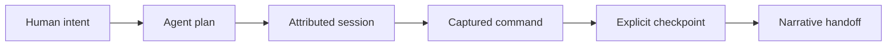

# SMALL examples

**See the protocol as a working system, not a pile of schema fixtures.**

These examples are committed, inspectable SMALL workspaces. Start with the
session walkthrough, then use the focused v1 labs when you want to understand a
specific invariant.

<p align="center">
  <a href="../docs/media/small-v1-1-0-session-demo.mp4">
    
  </a>
</p>

<p align="center">
  <strong>31 seconds, real commands, real state.</strong><br>
  <a href="../docs/media/small-v1-1-0-session-demo.mp4">Watch the full-quality MP4</a>
  &middot;
  <a href="../docs/session-profile-v2.md">Read the session guide</a>
</p>

## Start here: inspect a durable session

[`durable-session/`](durable-session/) is a complete v2 workspace created with
the released `small v1.1.0` CLI. It preserves a v1 migration, a real command
receipt, explicit task acceptance, and a narrative handoff.

From the repository root:

```bash
small check --strict --dir examples/durable-session --workspace examples
small status --json --dir examples/durable-session
small reconstruct --dir examples/durable-session --task task-2
```

The last command reconstructs the work from durable state: the task is
`completed`, both evidence receipts are `verified`, and there are no semantic
conflicts.



`small apply` records what ran. `small checkpoint` records that the result was
actually reviewed and accepted. That boundary is intentional.

## Choose an example

| Example | Profile | What it makes visible |
|---|---|---|
| **[Durable session](durable-session/)** | v2 | Migration, solo-by-default sessions, command evidence, acceptance, and handoff |
| [Deterministic replay ID](replayid-v1/) | v1 | The same run-defining inputs produce the same handoff identity |
| [Mandatory replay ID](mandatory-replayid/) | v1 | Handoff identity and completed-task evidence are enforced invariants |
| [Evidence gate](verify-evidence-gate/) | v1 | A completed task is invalid until progress evidence exists |
| [Workspace scope](workspace-root-enforced/) | v1 | CI can distinguish published examples from a repository's live workspace |

The v1 directories are small protocol labs and regression fixtures. They stay
deliberately narrow so a single rule is easy to inspect.

## Verify the complete gallery

```bash
scripts/verify-examples.sh
```

Set `BIN_PATH` to test another binary:

```bash
BIN_PATH=/path/to/small scripts/verify-examples.sh
```

Every example must pass strict validation. The script discovers workspaces by
their `.small/` directory, so newly added examples join the gate automatically.

## Use these as references, not templates to hand-edit

The committed state is here for inspection and regression testing. In your own
project, create and evolve state with the CLI:

```bash
small init --intent "Describe the outcome"
small plan --add "First bounded task"
small check --strict
```

For session-capable state, follow the explicit migration and lifecycle in the
[v2 session profile](../docs/session-profile-v2.md). Never copy opaque IDs or
edit `.small/` state by hand.
